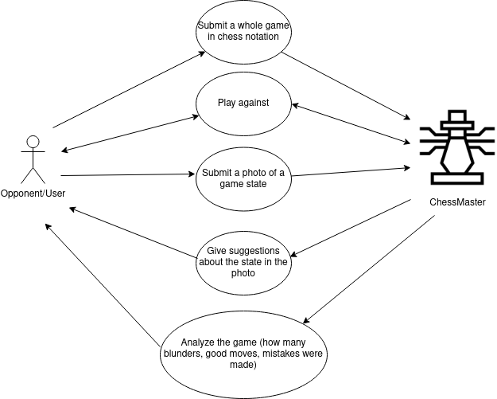
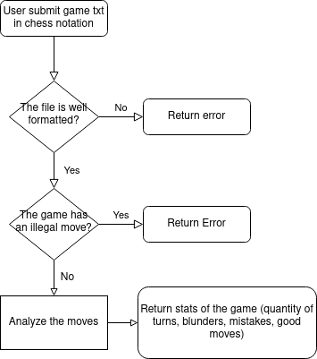

# ChessMaster: The coach and invincible AI

My objective is to play Chess in the best way possible.  

The Chess Master is an AI that can receive images of chess games, analyze them and answer with possible suggestions on what’s the best move, it can also understand chess notation and give a verdict about a move was either a blunder, a mistake, a dubious move, an interesting move, a good move or a brilliant move.  

The services this AI can offer are:

- Analyze a whole game in chess notation.
- Play against a human opponent (the player will submit an image or a move in chess
notation each turn and the AI will answer in chess notation).
- Analyze an image and determine the best chess move.  

## PEAS
---

**Performance Measure:** Quantity of turns played, win/lose ratio, ELO improvement of the
Opponent/students, Material advantage at the end of the game.

**Environment:** Opponent, Chess game, Chess pieces.

**Actuators:** Make a move, give the adversary a suggestion, lower or raise the cleverness of the moves.

**Sensors:** Know the current state of the game, know the time taken by the opponent to make a move, know the cleverness of the opponent move (blunder, mistake, dubious move, interesting move, good move, brilliant move), know the tactic the opponent is using (Fork, Pin, Gambit, Decoy, etc.).

## Environment
---
The environment is a chess game so it’s completely observable, the AI have all the information of the game, deterministic because it has a finite number of states and they’re known, not episodic because the current state of the game depends in the previous turns, static because if neither the agent nor the opponent make a move the game will stay still. And discrete cause the game is clearly split in turns.

## Usecases
---

## Submit a whole game in chess notation
---

## Play Against
---

## Submit a photo of a game state
---

## Agent Model
---
